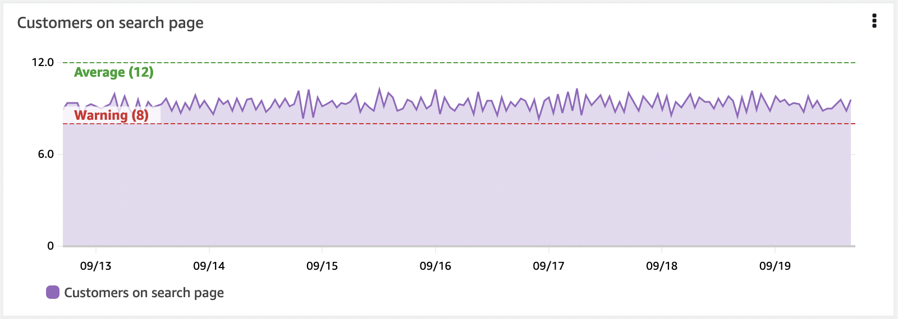

# ダッシュボード

ダッシュボードは、オブザーバビリティソリューションの重要な部分です。データのキュレーションされたビジュアライゼーションを生成できます。データの履歴を確認し、関連する他のデータとともに表示できます。コンテキストを提供することもできます。全体像を理解するのに役立ちます。 

多くの場合、人々はデータを収集し、アラームを作成して、そこで止まってしまいます。しかし、アラームはある時点のみを示すだけで、通常は単一のメトリクス、または少量のデータのみを示します。ダッシュボードは時間経過とともに動作を確認するのに役立ちます。


## 実践的な例:高 CPU 用のアラームを考える

インスタンスやアプリケーションの CPU 使用率が望ましい値よりも高いことがわかっています。
対応が必要なのか、そしてその緊急性はどの程度なのかを判断するために、以下の点を確認することが役立ちます。

* このインスタンス/アプリケーションにとって正常な CPU 使用率とはどの程度か
* スパイクなのか、CPU 使用率が徐々に上昇している傾向なのか
* パフォーマンスに影響しているか。まだ影響が出ていないとして、いつごろ影響が出始めるか
* こうした高 CPU は定期的に発生するものなのか。そして通常は自動的に回復するのか

### データの履歴を確認する

ここで、CPU の時系列チャートを含むダッシュボードを考えてみましょう。この単一のメトリクスからでも、これがスパイクなのか、上昇傾向なのかがわかります。また、上昇の速度もわかるので、対応の優先順位を決定することができます。

### ワークフローへの影響を確認する

しかし、このマシンは何をしているのでしょうか? 全体的なコンテキストの中で、どの程度重要なのでしょうか? ここで、レスポンスタイム、スループット、エラー、その他の測定値など、ワークフローのパフォーマンスの視覚化を追加したとします。 これにより、高い CPU 使用率が、このインスタンスがサポートしているワークフローやユーザーに影響を与えているかどうかを確認できます。

### アラームの履歴を確認する

過去1ヶ月間にアラームが発生した頻度を示す視覚化を追加し、さらに過去を遡ってこの発生が定期的なものかどうかを確認することを検討してください。
例えば、バックアップジョブがスパイクを引き起こしているのでしょうか。
再発のパターンを知ることで、根本的な問題を理解し、アラームの再発を完全に停止するための長期的な判断を下すことができます。

### コンテキストを追加する

最後に、ダッシュボードにコンテキストを追加します。このダッシュボードが存在する理由、関連するワークフロー、問題が発生したときの対処法、ドキュメントへのリンク、連絡先などの簡単な説明を含めます。

!!! info
    これでダッシュボードのユーザーが状況を把握し、影響を理解し、データに基づいて何を行動し、その緊急性を判断することができる*ストーリー*ができました。

### すべてを一度に可視化しようとしない

アラーム疲労についてよく話します。明確なアクションと優先順位がないアラームが多すぎると、チームが過負荷になり非効率を招くことがあります。アラームは、あなたにとって重要で実行可能なものにする必要があります。

ダッシュボードはここでより柔軟です。同じように注意を要求するわけではないので、まだ重要かどうか確信が持てないものや、調査を支援するものを可視化する余地がより大きくなります。それでも、過剰は禁物です! 良いものでも過ぎたるは及ばざるがごとしです。

ダッシュボードは、あなたにとって重要なものの全体像を提供する必要があります。インジェストするデータを決定するのと同様に、ダッシュボードにとって何が重要かを考える必要があります。
ダッシュボードの場合、次のことを考えてください。

* 誰がこれを見るのか
    * その人のバックグラウンドと知識は何か 
	* どの程度のコンテキストが必要か
* どのような質問に答えようとしているのか
* このデータを見た結果として、どのようなアクションを取るのか

!!! tip
    ダッシュボードのストーリーをどうするべきか、どの程度含めるべきか、判断しにくいことがよくあります。そこで、ダッシュボードの設計をどこから始めればいいでしょうか。*KPI駆動*か*インシデント駆動*の2つの方法を見ていきましょう。

#### ダッシュボードの設計: KPI 主導

これを理解する1つの方法は、KPI から逆算することです。これは通常、非常にユーザー主導のアプローチです。
 レイアウト の場合、通常、ダッシュボードの上から下に移動したり、下位のダッシュボードにナビゲートしたりして、詳細に踏み込んでいきます。

まず、**KPI の理解**が重要です。それらの意味するところを理解することで、どのように可視化したいかを決定するのに役立ちます。
多くの KPI は単一の数字として示されます。たとえば、特定のワークフローを正常に完了した顧客の割合とその所要時間はどうか? しかし、どの程度の期間でしょうか? 1週間の平均であれば KPI を満たしていても、この期間内で基準を超える時期がある可能性があります。こうした違反は重要なのでしょうか? 顧客体験に影響しますか? 影響がある場合は、異なる期間と時系列チャートを使用して KPI を確認することを検討するかもしれません。また、詳細を必要としないユーザーもいるでしょうから、KPI の内訳を別のダッシュボードに移動し、別の対象者向けにすることもできます。

次に、**これらの KPI に影響する要因は何か** を特定します。これらのアクションが発生するためには、どのようなワークフローが実行されている必要がありますか? これらを測定できますか?

主要コンポーネントを特定し、それらのパフォーマンスの可視化を追加します。KPI が基準値を超えたときに、ワークフローのどこに主な影響があるかをすぐに確認できる必要があります。


そして、さらに下のレベルまで掘り下げることができます。これらのワークフローのパフォーマンスに影響を与える要因は何でしょうか。掘り下げる深さを決定する際は、対象者を考慮してください。

注文数を KPI とする EC サイトを例に考えてみましょう。
注文を行うために、ユーザーは次のアクションを実行できる必要があります: 商品の検索、カートへの追加、配送詳細の入力、注文の支払い。
これらの各ワークフローで、主要コンポーネントが正常に機能していることを確認することを検討できます。たとえば、RUM や Synthetics を使用して、アクションの成功とユーザーが問題の影響を受けているかどうかのデータを取得します。スループット、レイテンシ、失敗したアクションの割合などの測定を行い、各アクションのパフォーマンスが期待どおりであるかを確認できます。基盤となるインフラストラクチャの測定を行い、パフォーマンスに影響を与えている可能性のある要因を確認できます。

ただし、すべての情報を同じダッシュボードに置く必要はありません。ここでも、対象者を考慮してください。

!!! success
    ドリルダウンを可能にし、適切なコンテキストを適切なユーザーに提供するダッシュボードのレイヤーを作成します。

#### インシデント駆動のダッシュボード設計

多くの人にとって、インシデントの解決はオブザーバビリティの主要なドライバーです。ユーザーやオブザーバビリティアラームから問題が通知され、迅速に修正を見つけ、潜在的な問題の根本原因を特定する必要があります。

!!! success
    最近のインシデントから始めましょう。共通のパターンはありますか? 会社にとって最も影響力のあるものはどれですか? 繰り返し発生するものはどれですか?

この場合、重要度を理解し、根本原因を特定し、インシデントを修正しようとしている人々のためのダッシュボードを設計しています。	

特定のインシデントを思い出してください。

* インシデントが報告されたとおりに検証するにはどうしましたか?
    * 何をチェックしましたか? エンドポイント? エラー?
* 影響や優先順位を理解するにはどうしましたか?	
* 問題の原因を調べるために何を確認しましたか?

Application Performance Monitoring (APM) は、エンドポイントとワークフローの定期的なベースラインとテストのために [Synthetics](../tools/synthetics/) を使用し、実際の顧客体験のために [RUM](../tools/rum/) を使用することでここで役立ちます。 このデータを使用して、どのワークフローが影響を受けているかと影響の程度をすばやく視覚化できます。

時間とともにエラー数を示す視覚化や、上位のエラー数を示すものは、正しい領域に焦点を当て、エラーの詳細を示すのに役立ちます。 ここではログデータを頻繁に使用しており、エラーコードと理由の動的な視覚化をしています。

可能な限り早く詳細にたどり着くために、フィルタリングやドリルダウンなどを行うと非常に便利です。 過度なオーバーヘッドを伴わずにこれを実装する方法を考えてください。 たとえば、詳細に近づくためにフィルタできる単一のダッシュボードを用意するなどです。

### レイアウト

ダッシュボードのレイアウトも重要です。

!!! success
    通常、ユーザーが最も重要だと考える視覚化は、ページの左上、あるいはページ移動の自然な*始点*に配置するのがよいでしょう。

レイアウトを使用してストーリーを伝えることができます。 たとえば、上から下にスクロールするにつれて、より詳細な情報が表示されるトップダウンレイアウトを使用できます。 または、左側に上位サービス、右側に依存関係を配置する左右のレイアウトが役立つ場合もあります。

### 動的なコンテンツの作成

需要に応じて成長したり縮小したりするように設計されているワークロードが多数あります。ダッシュボードはこれを考慮する必要があります。 
たとえば、インスタンスをオートスケーリンググループに置いている場合、特定の負荷に達すると追加のインスタンスが追加されます。

!!! success
    特定のインスタンスからのデータを示すダッシュボードは、それらの新しいインスタンスからのデータが表示されることはありません。 
    リソースとデータにメタデータを追加することで、特定のメタデータ値を持つすべてのインスタンスをキャプチャする視覚化を作成できます。 
    この方法では、実際の状態が反映されます。

動的な視覚化の別の例は、現在発生している上位10のエラーと、最近の履歴でのそれらの動作を見つけることができることです。 
どのエラーが発生するかを知らずに、テーブルやチャートを見ることができます。

### 原因よりもまず症状を考える

症状を観察するとき、ユーザーやシステムへの影響について考えています。多くの根本原因が同じ症状を引き起こす可能性があります。これにより、未知の問題を含む、より多くの問題を把握できます。原因を理解するにつれて、下位レベルのダッシュボードは、これらの問題を迅速に診断および修正するのに役立つように、より具体的なものになる可能性があります。

!!! tip
    先週ユーザーに影響を与えた特定の JavaScript エラーを記録するのではなく、*ワークフローへの影響*や、最近の履歴での JavaScript エラーの上位カウント、または最近の履歴で劇的に増加したものを記録します。

### 上位/下位 N を使用する

ほとんどの場合、同時に*すべての*運用メトリクスを可視化する必要はありません。多数の EC2 インスタンスのフリートは、この良い例です。数百台のサーバーから成るファーム全体のディスク IOPS や CPU 使用率を同時に表示する必要や価値はありません。これは、メトリクスの中から最高(または最低)のパフォーマンスのリソースを見つけ出そうと時間を費やすというアンチパターンを生み出します。

!!! success
    ダッシュボードを使用して、任意のメトリクスの上位 10 件や 20 件を表示し、これが明らかにする 症状 に焦点を当ててください。

[CloudWatch メトリクス](../tools/metrics/) を使用すると、任意の時系列の上位 N を検索できます。たとえば、このクエリは CPU 使用率が最も高い上位 20 の EC2 インスタンスを返します。

```
SORT(SEARCH('{AWS/EC2,InstanceId} MetricName="CPUUtilization"', 'Average', 300), SUM, DESC, 10)
```

このアプローチ、または [CloudWatch Metric Insights](https://docs.aws.amazon.com/AmazonCloudWatch/latest/monitoring/query_with_cloudwatch-metrics-insights.html) を使用して、ダッシュボードのパフォーマンスの高い/低いメトリクスを特定してください。

### 閾値を使用した KPI の視覚的表示

KPI には警告やエラーの閾値を設定する必要があり、ダッシュボードではこれを水平アノテーションを使用して表示できます。これはウィジェット上に高水位マークとして表示されます。これを視覚的に表示することで、ビジネスの成果やインフラストラクチャが危険な状態にある場合に、人間のオペレーターに事前警告を出すことができます。



!!! success
    水平アノテーションは、完成度の高いダッシュボードの重要な部分です。

### コンテキストの重要性

人々はデータを簡単に誤解する可能性があります。背景や現在のコンテキストが、データの見方に影響を与えます。

だから、ダッシュボード内に*テキスト*を含めることを確認してください。このデータは何のためのものか、誰のためのものか。それは何を意味しているのか。アプリケーションのドキュメントへのリンク、サポート担当者、トラブルシューティングドキュメントへのリンクを含めてください。テキストディスプレイを使用してダッシュボードディスプレイを分割することもできます。左右のコンテキストを設定するために左側に配置します。ダッシュボードを垂直に分割するために全横ディスプレイとして使用します。  

!!! success
    IT サポート、オンコール運用、ビジネスオーナーへのリンクを持つことで、チームは問題が発生したときに助けてくれる人にすばやく連絡できるようになります。
    
!!! tip
    ダッシュボードへのチケットシステムへのハイパーリンクも非常に有用な追加機能です。
