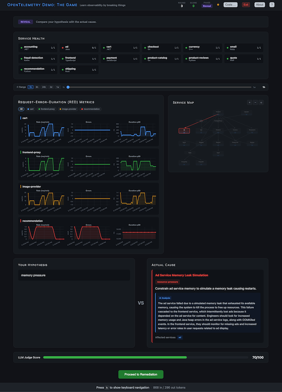
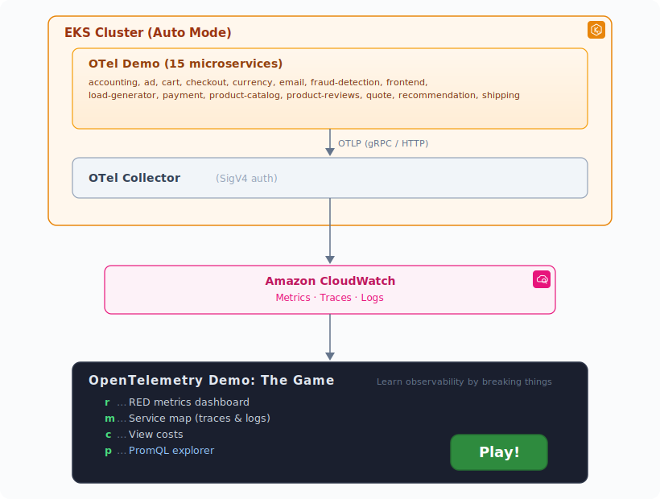

# OpenTelemetry Demo: The Game

<table>
<tr>
<td width="40%" valign="top">

<strong>OpenTelemetry Demo: The Game (ODTG)</strong> takes the [OpenTelemetry Demo](https://opentelemetry.io/docs/demo/) and gamifies it, teaching you observability by breaking microservices and diagnosing failures. A game consists of 5 rounds. In each round, ODTG randomly picks one out of over 40 different failure scenarios and injects it. Your task is
figuring out what happened and submit a hypothesis about the root cause. Your hypothesis is rated by an LLM judge and you can earn up to 100 points per round.

It runs on Amazon EKS in Auto Mode with the OpenTelemetry Demo application consisting of 15 services deployed. Observability is powered by Amazon CloudWatch with the telemetry natively ingested using OTLP.

You can explore metrics using PromQL, and view traces and logs of the services.

> **NOTE:** This is a demo app and it comes AS IS. We do not support it and you can use it at your own risk.
</td>
<td width="60%" valign="top">



</td>
</tr>
</table>

## Architecture



## Usage

### Prerequisites

- AWS CLI configured with appropriate permissions
- `eksctl` installed
- `helm` installed
- `kubectl` installed
- Node.js 20+

### Environment Variables

| Variable | Default | Description |
|----------|---------|-------------|
| `AWS_REGION` | `eu-west-1` | AWS region |
| `CW_LOG_GROUP` | `/otel/demo` | CloudWatch log group |
| `LLM_PROVIDER` | `bedrock` | LLM provider: `bedrock`, `anthropic`, or `openai` |
| `LLM_MODEL_ID` | `amazon.nova-pro-v1:0` | Bedrock model ID, Anthropic model name, or OpenAI model name. For Bedrock, the regional inference profile prefix (`us.`, `eu.`, `ap.`) is added automatically based on `AWS_REGION` |
| `LLM_API_KEY` | _(empty)_ | API key (required for `anthropic` and `openai` providers; not needed for `bedrock`) |
| `LLM_ENDPOINT` | _(empty)_ | Base URL for an OpenAI-compatible API (only used when `LLM_PROVIDER=openai`) |

### Deployment

1. Deploy the infrastructure (EKS cluster and OTel demo app)

```bash
cd infra
./setup.sh
```

> NOTE: This creates an EKS Auto Mode cluster, deploys the OTel demo, and configures CloudWatch OTLP ingestion.

2. Run the Game

To use the OpenTelemetry Demo:

```bash
kubectl port-forward -n otel-demo svc/frontend-proxy 8080:8080 
```

And then open http://localhost:8080/

To use the game:

```bash
npm install
npm run dev
```

And then open http://localhost:5173/

### Play

1. Click **Play** and the game randomly picks one of its many failure scenarios
2. Observe the **RED metrics dashboard** (Rate, Errors, Duration) and **Service map**
3. Click **Get Hint** when ready; the game reveals a clue about what went wrong
4. Write your **hypothesis** about the root cause
5. The game **reveals** the actual cause side-by-side with your guess, and an **LLM judge scores** your hypothesis at a scale form 0 to 100
6. Follow the **remediation steps** manually or click Auto-Remediate to let the app do it

### Teardown

1. Remove the game app resources:

```bash
cd odtg-app
./undeploy.sh
```

2. Tear down the infrastructure (EKS cluster, IAM roles, CloudWatch log group):

```bash
cd infra
./teardown.sh
```

> NOTE: Cluster deletion takes ~10 minutes.


## Internals

### CloudWatch OTLP Configuration

The OTel Collector is configured to export to CloudWatch using native OTLP endpoints:

- **Logs** → `https://logs.<region>.amazonaws.com/v1/logs` … CloudWatch Logs
- **Metrics** → `https://monitoring.<region>.amazonaws.com/v1/metrics` … CloudWatch Metrics
- **Traces** → `https://xray.<region>.amazonaws.com` … X-Ray

Authentication uses SigV4 via IRSA (IAM Roles for Service Accounts).

### LLM Judge

When a player submits a hypothesis, an LLM scores it from 0 to 100 against the actual root cause. The score is shown as a progress bar on the reveal screen and used as the round's point value.

#### Default — AWS Bedrock (no API key needed)

If you're already running with AWS credentials (same ones used for CloudWatch), the judge works out of the box. It calls Amazon Nova Pro via the Bedrock Converse API.

```bash
# .env — nothing extra required beyond your existing AWS config
LLM_PROVIDER=bedrock
LLM_MODEL_ID=amazon.nova-pro-v1:0
```

The correct inference profile prefix (`us.`, `eu.`, `ap.`) is added automatically based on your `AWS_REGION`. You can also set a fully-prefixed ID or ARN directly if you prefer. To use a different Bedrock model, set `LLM_MODEL_ID` to any supported model (e.g. `anthropic.claude-sonnet-4-20250514-v1:0`). Make sure the model is enabled in your account and region.

#### Anthropic API

Use Claude directly via the Anthropic API:

```bash
# .env
LLM_PROVIDER=anthropic
LLM_API_KEY=sk-ant-...
LLM_MODEL_ID=claude-sonnet-4-20250514
```

#### OpenAI-compatible endpoint

Set `LLM_PROVIDER=openai` to point at any OpenAI-compatible API:

```bash
# .env
LLM_PROVIDER=openai
LLM_API_KEY=sk-...
LLM_ENDPOINT=https://api.openai.com/v1
LLM_MODEL_ID=gpt-4o-mini
```

This also works with self-hosted endpoints (vLLM, Ollama with OpenAI compat, etc.).

### Tech Stack

- **Frontend**: SvelteKit 2 + Svelte 5, Chart.js
- **Backend**: SvelteKit server routes, @kubernetes/client-node, AWS SDK
- **Infra**: EKS Auto Mode, OpenTelemetry Demo Helm chart, CloudWatch OTLP
