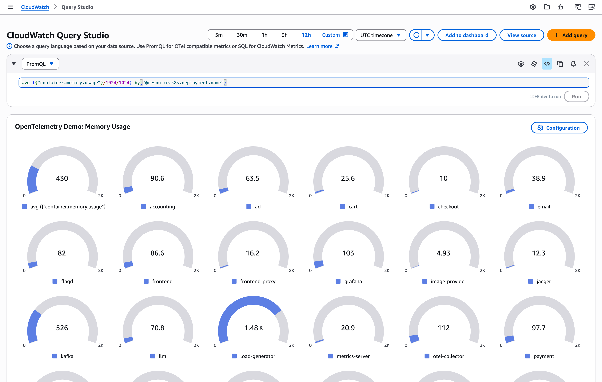
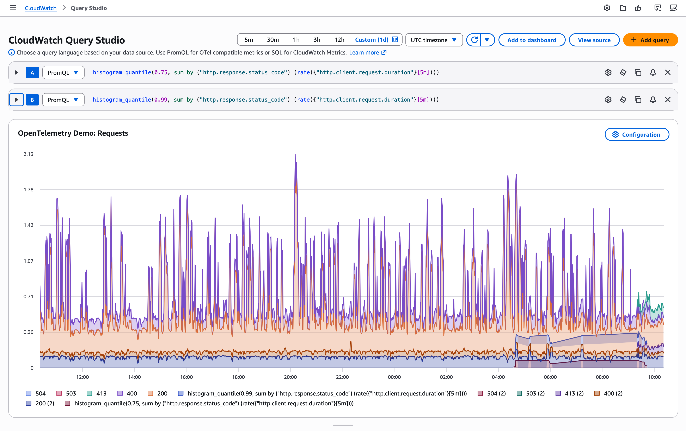
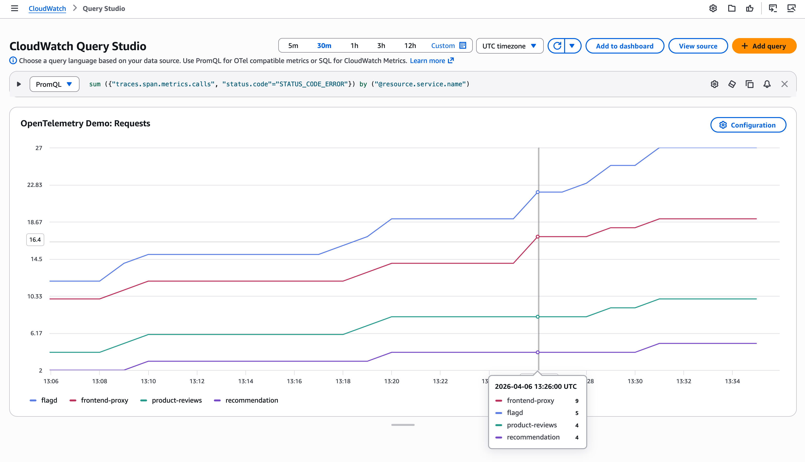
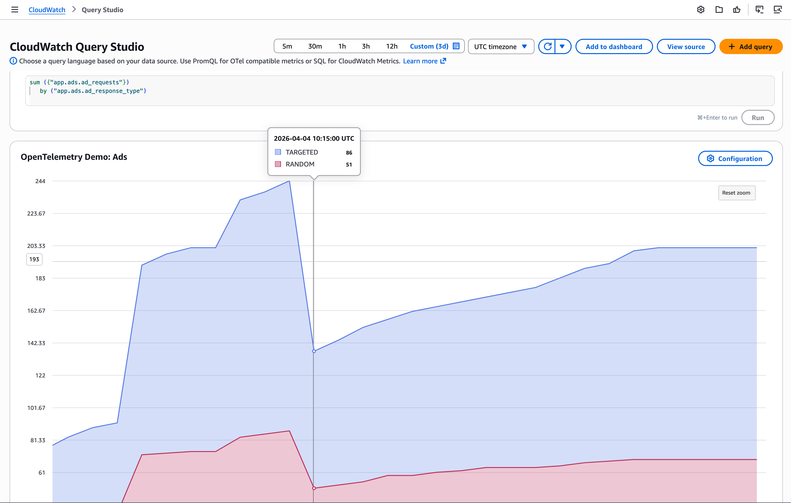
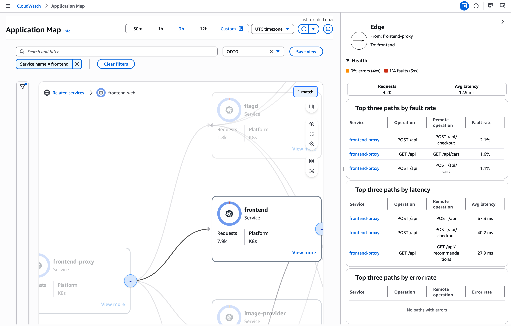

# Developer Guide — OTel Chaos Game

This document covers the web application architecture, server-side modules,
API surface, frontend components, and how to extend the game with new
scenarios.

## Prerequisites

- Node.js 20+
- A running EKS cluster with the OTel demo deployed (see `docs/INFRASTRUCTURE.md`)
- A valid kubeconfig pointing at the cluster
- AWS credentials with CloudWatch read access

## Running locally

```bash
cd otel-chaos-game
npm install
npm run dev          # http://localhost:5173
```

The dev server needs network access to both the Kubernetes API (via your
kubeconfig) and CloudWatch (via your AWS credentials / environment).

Type-check without building:

```bash
npm run check
```

Production build:

```bash
npm run build
npm run preview      # serves the built app on :4173
```

## Project layout

```
src/
├── lib/
│   ├── types.ts              # Shared TypeScript interfaces
│   ├── scenarios.ts          # 30 chaos scenario definitions
│   ├── game-store.svelte.ts  # Svelte 5 reactive game state store
│   ├── server/               # Server-only modules (never sent to browser)
│   │   ├── k8s.ts            # Kubernetes client wrapper
│   │   ├── chaos-engine.ts   # Scenario trigger + cleanup logic
│   │   ├── cloudwatch.ts     # CloudWatch metrics, logs & traces reader
│   │   ├── game-state.ts     # In-memory game state machine
│   │   ├── discovery.ts      # K8s deployment name resolution + caching
│   │   ├── flagd.ts          # Feature flag management via flagd ConfigMap
│   │   ├── costs.ts          # AWS Cost Explorer integration
│   │   ├── llm-judge.ts      # LLM-based hypothesis scoring (Bedrock/Anthropic/OpenAI)
│   │   └── llm-score-store.ts # Score persistence between endpoints
│   └── components/           # Svelte 5 UI components
│       ├── AboutModal.svelte
│       ├── CostsModal.svelte
│       ├── FullscreenModal.svelte
│       ├── HypothesisForm.svelte
│       ├── LogsModal.svelte
│       ├── PromQLModal.svelte
│       ├── RedDashboard.svelte
│       ├── RemediatePanel.svelte
│       ├── RevealPanel.svelte
│       ├── ScoreBoard.svelte
│       ├── ServiceGrid.svelte
│       ├── ServiceMap.svelte
│       ├── TimeRangePicker.svelte
│       └── TracesModal.svelte
├── routes/
│   ├── +layout.svelte        # App shell, nav, global styles
│   ├── +page.svelte          # Main game page (state machine UI)
│   └── api/                  # SvelteKit server routes (JSON APIs)
│       ├── game/
│       │   ├── trigger/      # POST — pick & inject a random scenario
│       │   ├── hint/         # GET  — reveal hint + expected symptoms
│       │   ├── hypothesis/   # POST — submit player hypothesis, reveal cause
│       │   ├── remediate/    # POST — auto-remediate or mark manual fix
│       │   ├── state/        # GET  — current game state
│       │   └── reset/        # POST — reset score and history
│       ├── metrics/          # GET  — RED metrics from CloudWatch PromQL
│       ├── logs/             # GET  — service logs from CloudWatch
│       ├── traces/           # GET  — service traces from CloudWatch Logs Insights
│       ├── services/         # GET  — live deployment status from K8s
│       ├── costs/            # GET  — cost breakdown from AWS Cost Explorer
│       └── promql/           # GET  — PromQL proxy + metadata endpoint
├── app.html                  # HTML template
└── app.d.ts                  # SvelteKit type augmentations
```

## Core concepts

### Game state machine

The game progresses through phases managed by `game-state.ts`:

```
idle → triggering → observing → hypothesis → reveal → remediate → complete
                                                                      │
                                                                      ↓
                                                              idle (next round)
```

State is held in-memory in a module-level variable. This is intentional —
the app is single-player, single-instance. A restart resets the game.

### Chaos scenarios

Each scenario in `scenarios.ts` is a `ChaosScenario` object:

| Field              | Purpose                                              |
|--------------------|------------------------------------------------------|
| `id`               | Unique key, used by `chaos-engine.ts` switch/case    |
| `name`             | Human-readable title shown in the reveal panel       |
| `category`         | One of: `pod-kill`, `load-spike`, `resource-pressure`, `network-fault`, `config-fault`, `feature-flag` |
| `description`      | What the scenario does (shown after reveal)          |
| `targetServices`   | Service names from `OTEL_SERVICES` affected          |
| `hint`             | Clue shown to the player during hypothesis phase     |
| `expectedSymptoms` | Observable effects listed alongside the hint         |
| `remediationSteps` | Ordered kubectl commands to fix the issue            |

### Chaos engine

`chaos-engine.ts` maps each scenario ID to a concrete Kubernetes mutation
or feature flag toggle:

| Function               | K8s / flagd operation                              |
|------------------------|----------------------------------------------------|
| `killServicePod`       | Deletes the pod, then scales deployment to 0       |
| `spikeLoadGenerator`   | Sets `LOCUST_USERS` / `LOCUST_SPAWN_RATE` env vars |
| `constrainCpu`         | Patches container CPU limits to a tiny value       |
| `constrainMemory`      | Patches container memory limits to trigger OOMKill |
| `injectNetworkDelay`   | Sets `HTTP_PROXY`/`HTTPS_PROXY` to a non-routable address, simulating network delay |
| `injectPacketLoss`     | Sets `HTTP_PROXY`/`HTTPS_PROXY` to a non-routable address, simulating packet loss |
| `corruptEnvVar`        | Sets an env var to an invalid value                |
| `enableFlag`           | Enables a feature flag in the flagd ConfigMap      |

Network fault injection uses proxy env vars instead of `tc qdisc` because
the demo containers don't include `iproute2`.

Each function records the original state in an in-memory `Map` so that
`cleanupScenario` can reverse the change (scale back up, restart to clear
env/resources/network, or restore the flagd ConfigMap).

Deployment names are resolved at runtime via the discovery module rather
than being hardcoded, since the Helm chart naming can vary by version.

### Kubernetes client (`k8s.ts`)

Wraps `@kubernetes/client-node`. Key exports:

- `coreApi()` — returns a `CoreV1Api` client (singleton, lazy-initialized)
- `appsApi()` — returns an `AppsV1Api` client (singleton, lazy-initialized)
- `listPods(namespace, labelSelector?)` — list pods
- `deletePod(namespace, name)` — delete a single pod
- `scaleDeployment(namespace, name, replicas)` — patch replica count
- `patchDeploymentResources(namespace, name, idx, resources)` — patch CPU/memory limits
- `setEnvVar(namespace, deployment, key, value)` — read-modify-write an env var
- `execInPod(namespace, pod, command[])` — exec a command inside a running pod
- `getDeploymentStatus(namespace, name)` — returns replica counts

Write operations (`scaleDeployment`, `patchDeploymentResources`,
`setEnvVar`) use a `retryOnConflict` wrapper that retries up to 5 times
on HTTP 409 Conflict responses with exponential backoff + jitter.

The client loads kubeconfig from the default location (`~/.kube/config` or
the `KUBECONFIG` env var). In-cluster config is also supported automatically.

### Discovery module (`discovery.ts`)

Resolves human-friendly service names (e.g. `"checkout"`) to actual K8s
deployment names (e.g. `"otel-demo-checkoutservice"`) by listing all
deployments in the `otel-demo` namespace and fuzzy-matching against the
service's search hint. Results are cached after the first call and can be
invalidated via `invalidateDiscoveryCache()` (called after cleanup).

### Feature flag management (`flagd.ts`)

Manages feature flags by reading and writing the `flagd-config` ConfigMap
in the `otel-demo` namespace. The `enableFlag(flagName)` function sets a
flag's `defaultVariant` to its "on" variant and saves the original config
for later restoration via `restoreFlags()`.

### CloudWatch client (`cloudwatch.ts`)

Reads telemetry that the OTel Collector has exported to CloudWatch:

- `getREDMetrics(services, start, end)` — queries the CloudWatch PromQL
  endpoint (SigV4-signed) for rate, errors, and p99 duration per service
  using the `traces.span.metrics.calls` and `traces.span.metrics.duration`
  metrics generated by the spanmetrics connector.
- `getAllServicesREDMetrics(start, end)` — convenience wrapper that returns
  RED metrics for all services (excluding load-generator and flagd).
- `getServiceLogs(service, start, end)` — queries `FilterLogEvents` with a
  JSON filter on `service.name`.
- `getServiceTraces(service, start, end)` — queries CloudWatch Logs Insights
  against the `aws/spans` log group (Transaction Search) to fetch traces
  grouped by trace ID with full span details.

Configuration via environment variables:

| Variable                   | Default                          | Description                                |
|----------------------------|----------------------------------|--------------------------------------------|
| `AWS_REGION`               | `eu-west-1`                      | AWS region                                 |
| `CW_LOG_GROUP`             | `/otel/demo`                     | CloudWatch Logs group name                 |
| `CW_SPANS_LOG_GROUP`       | `aws/spans`                      | Log group for Transaction Search traces    |
| `PROMQL_SVC_LABEL`         | `@resource.service.name`         | PromQL label for service name              |
| `PROMQL_CALLS_METRIC`      | `traces.span.metrics.calls`      | PromQL metric name for span call counts    |
| `PROMQL_DURATION_METRIC`   | `traces.span.metrics.duration`   | PromQL metric name for span durations      |

### Cost Explorer client (`costs.ts`)

Queries AWS Cost Explorer to build a cost breakdown for the game
infrastructure. Costs are grouped into two categories:

- **Infrastructure** — EKS, EC2, EBS costs, further broken down by usage
  type (Compute, EKS Control Plane, EKS Auto Mode, Storage, Networking).
- **Observability** — CloudWatch and X-Ray costs, broken down by signal
  (Logs Ingest, Logs Query, Metrics Ingest, Metrics Query, Traces Ingest,
  Traces Query).

When CUR split cost allocation is active (detected by checking if the
`Project` tag has values), costs are filtered by the `Project=otel-chaos-game`
tag. Otherwise, costs are filtered by a hardcoded list of AWS service names.

### LLM judge (`llm-judge.ts`)

Uses an LLM to score player hypotheses on a continuous 0–100 scale and
to generate plain-language explanations of chaos scenarios. Supports
three providers:

- **Bedrock** (default) — uses the Converse API with cross-region
  inference profiles.
- **Anthropic** — direct API calls with an API key.
- **OpenAI-compatible** — any endpoint implementing the chat completions API.

Configuration via environment variables:

| Variable         | Default                | Description                          |
|------------------|------------------------|--------------------------------------|
| `LLM_PROVIDER`   | `bedrock`              | `bedrock`, `anthropic`, or `openai`  |
| `LLM_MODEL_ID`   | `amazon.nova-pro-v1:0` | Model identifier                     |
| `LLM_API_KEY`    | —                      | API key (Anthropic/OpenAI only)      |
| `LLM_ENDPOINT`   | —                      | Custom endpoint (OpenAI-compatible)  |

Token usage is tracked cumulatively per session and exposed via
`getTokenUsage()` and `getLlmCosts()` (with per-model pricing).

## API reference

All routes return JSON.

### Game flow

| Method | Path                    | Description                                    |
|--------|-------------------------|------------------------------------------------|
| GET    | `/api/game/state`       | Returns current `GameState`                    |
| POST   | `/api/game/trigger`     | Picks a random scenario, injects chaos         |
| GET    | `/api/game/hint`        | Returns hint + expected symptoms               |
| POST   | `/api/game/hypothesis`  | Body: `{ hypothesis: string }`. Reveals cause  |
| POST   | `/api/game/remediate`   | Body: `{ action: "auto-remediate" | "manual-complete" }` |
| POST   | `/api/game/reset`       | Resets score, round, history                   |

### Observability data

| Method | Path                    | Query params                          | Description                              |
|--------|-------------------------|---------------------------------------|------------------------------------------|
| GET    | `/api/metrics`          | `service?`, `minutes?` (default: 15)  | RED metrics from CloudWatch PromQL       |
| GET    | `/api/logs`             | `service` (required), `minutes?`      | Service logs from CloudWatch             |
| GET    | `/api/traces`           | `service` (required), `minutes?`      | Service traces from CloudWatch Logs Insights |
| GET    | `/api/services`         | —                                     | Live K8s deployment statuses             |
| GET    | `/api/costs`            | `days?` (default: 30)                 | Cost breakdown from AWS Cost Explorer    |
| GET    | `/api/promql`           | `query`, `start?`, `end?`, `step?`    | PromQL proxy to CloudWatch               |
| GET    | `/api/promql/metadata`  | —                                     | PromQL metric metadata                   |

## Frontend components

All components use Svelte 5 runes (`$state`, `$props`, `$effect`).

| Component              | Role                                                        |
|------------------------|-------------------------------------------------------------|
| `ScoreBoard`           | Displays round number, total score, phase badge, history dots |
| `RedDashboard`         | Three Chart.js line charts (rate, errors, duration) per service. Polls every 10s. |
| `ServiceGrid`          | Grid of service cards with health dot (green/red pulsing), language tag, replica count. Polls every 15s. |
| `ServiceMap`           | Visual service dependency map                               |
| `HypothesisForm`       | Split panel: hint + symptoms on the left, textarea on the right |
| `RevealPanel`          | Side-by-side: player hypothesis vs actual cause with category badge and affected services |
| `RemediatePanel`       | Ordered remediation steps with checkboxes, plus auto-remediate and manual-complete buttons |
| `TimeRangePicker`      | Time range selector for metrics/logs/traces queries         |
| `LogsModal`            | Fullscreen modal for viewing service logs                   |
| `TracesModal`          | Fullscreen modal for viewing service traces with span details |
| `PromQLModal`          | Fullscreen modal for running ad-hoc PromQL queries          |
| `CostsModal`           | Fullscreen modal showing infrastructure and observability cost breakdown |
| `AboutModal`           | About/help modal                                            |
| `FullscreenModal`      | Reusable fullscreen modal wrapper                           |

## Adding a new chaos scenario

1. Add a `ChaosScenario` entry to `src/lib/scenarios.ts`.
2. Add a `case` for the new `id` in the `triggerScenario` switch in
   `src/lib/server/chaos-engine.ts`, calling one of the existing helper
   functions or writing a new one. For feature-flag scenarios, call
   `enableFlag(flagName)`.
3. If you wrote a new helper, make sure it records original state in the
   `originalState` map and that `cleanupScenario` can reverse it.
   Feature-flag scenarios are cleaned up automatically via `restoreFlags()`.
4. That's it — the UI, API, and game loop are all scenario-agnostic.

## Scoring

Hypotheses are scored by an LLM judge (`llm-judge.ts`) on a continuous
0–100 scale. The judge compares the player's hypothesis against the
actual root cause description and returns a score reflecting correctness.

If the LLM is unavailable, scoring falls back to:
- 100 points for a correct round completion.
- 25 points partial credit for an incorrect completion.

The LLM also generates a plain-language explanation of each scenario's
root cause, shown in the reveal panel.

Token usage and estimated costs are tracked per session and exposed via
the `/api/costs` endpoint alongside infrastructure costs.


## Using CloudWatch

You can use Amazon CloudWatch to query and visualize the telemetry signals (logs, metrics, traces) ingested via OTLP.

### Metrics: PromQL

Use [PromQL in the AWS console](https://docs.aws.amazon.com/AmazonCloudWatch/latest/monitoring/CloudWatch-PromQL-Querying.html) or configure the CloudWatch PromQL API as a data source in Grafana.

Memory usage by service (in MB):

```
avg ({"container.memory.usage"}/1024/1024)
   by("@resource.k8s.deployment.name")
```



Comparing `p75` and `p99` request durations by HTTP response status code:

```
histogram_quantile(0.75,
   sum(rate({"http.client.request.duration"}[5m]))
      by("http.response.status_code")
)

histogram_quantile(0.99,
   sum(rate({"http.client.request.duration"}[5m]))
      by ("@resource.service.name")
)
```



RED metrics for all services, errors:

```
sum ({"traces.span.metrics.calls", "status.code"="STATUS_CODE_ERROR"})
   by ("@resource.service.name")
```



Advertisement requests by response type:

```
sum ({"app.ads.ad_requests"})
   by ("app.ads.ad_response_type")
```




### Traces: X-Ray

Use [X-Ray in the AWS console](https://docs.aws.amazon.com/xray/latest/devguide/xray-console-filters.html).

Search for traces:

```
(service(id(name: "frontend"  ))) AND (Annotation[aws.local.environment] = "k8s:default")
```

Visualize application map:




## Known limitations

- Game state is in-memory. Restarting the server resets everything.
- Single-player only. No auth, no sessions.
